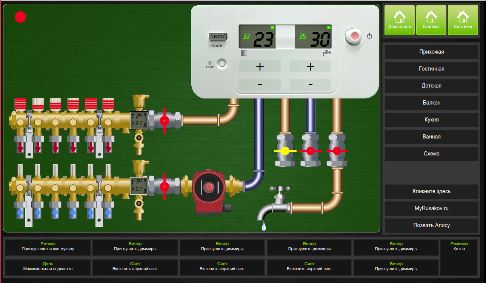
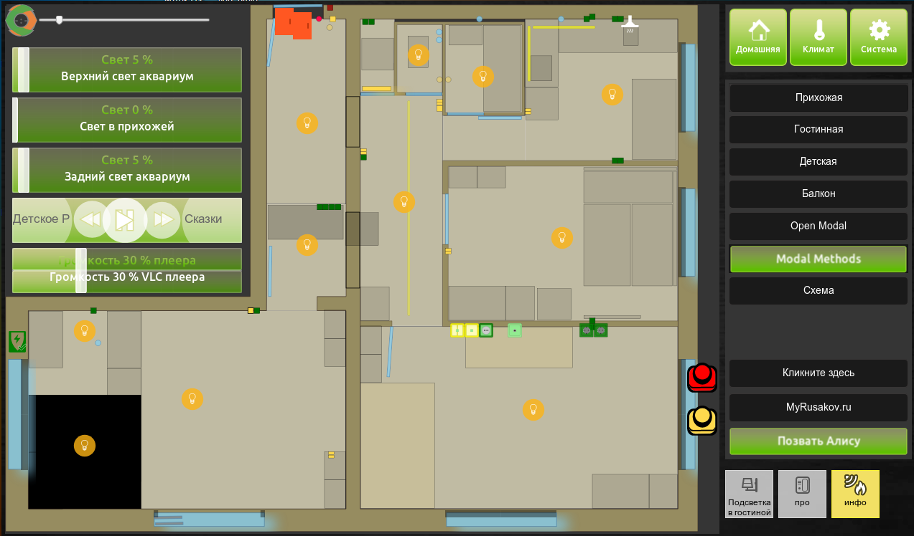

# Сцены
Сцена для МажорДоМо я её назвал OkBitScenes, если Влад не против.

Сделана по примеру темы Влада [OKbit на YouTube](https://www.youtube.com/watch?v=fNFgWQPQfe0&t=959s)

Модифицирована с применением SVG графики под планшет 10 дюймов разрешением 1280x748, 

работы ещё много но общая концепция есть ...

Сцена основная

Сцена котёл

Сцена музыка (фреймом вставлен RompR)

Сцена освещение

Сцена схема нарисована в SVG

